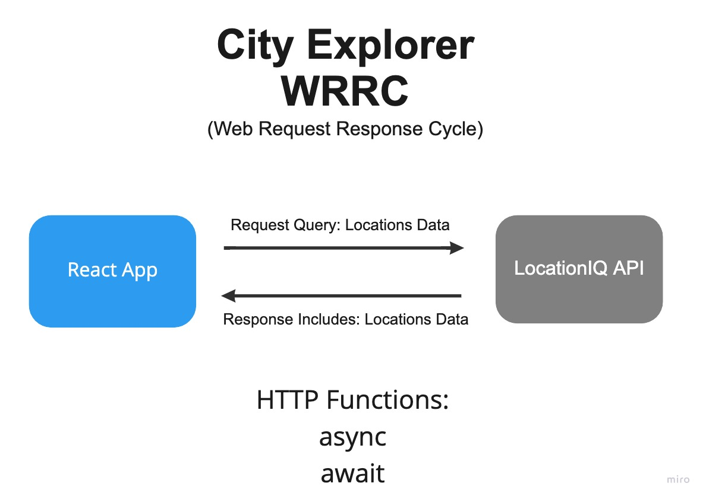

# City Explorer (Frontend)

**Author**: Alex Rivera
**Version**: 1.0.3
<!-- (increment the patch/fix version number if you make more commits past your first submission) -->

## Overview
<!-- Provide a high level overview of what this application is and why you are building it, beyond the fact that it's an assignment for this class. (i.e. What's your problem domain?) -->

App that requests data from locationIQ API using Axios based on user input. Renders data back to the user.

## Getting Started

<!-- What are the steps that a user must take in order to build this app on their own machine and get it running? -->

[Trello Board](https://trello.com/invite/b/jZlZQMRq/2976b716ca5978dca4d6fca5cd99f3f2/alexs-city-explorer)

## Architecture
<!-- Provide a detailed description of the application design. What technologies (languages, libraries, etc) you're using, and any other relevant design information. -->

* React
* Bootstrap
* NodeJS
* LocationIQ
* Axios

## Change Log
<!-- Use this area to document the iterative changes made to your application as each feature is successfully implemented. Use time stamps. Here's an example:

01-01-2001 4:59pm - Application now has a fully-functional express server, with a GET route for the location resource. -->

## Credit and Collaborations
<!-- Give credit (and a link) to other people or resources that helped you build this application. -->

* Daniel Brott

---

Name of feature: Lab06

Estimate of time needed to complete: 2.5hr

Start time: 9:00pm CST

Finish time: 1:00am CST

Actual time needed to complete: 4hr
